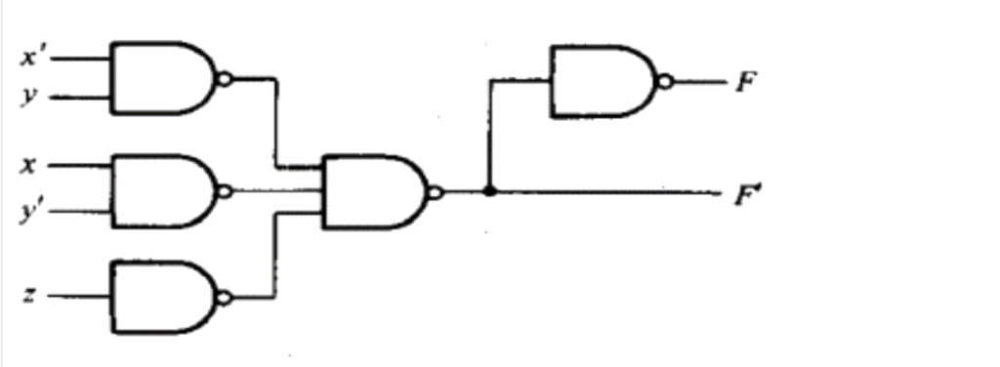
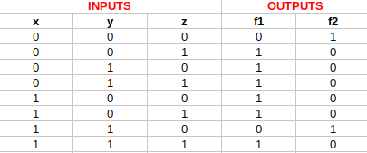
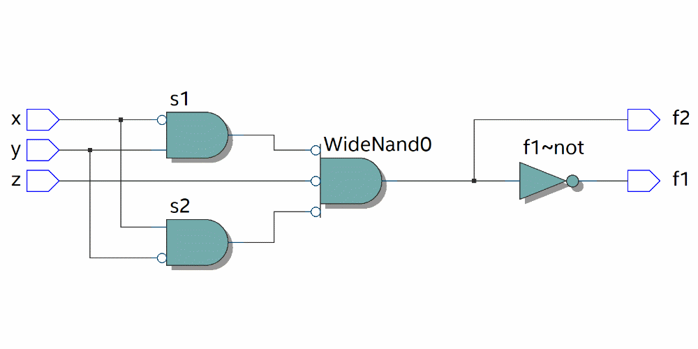
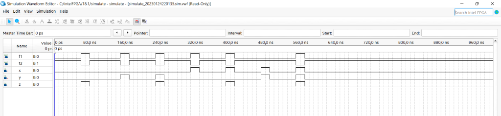

# Skill-Assessment-1-Design-And-Simulate-The-Given-Logic-Diagram-Using-Verilog-
## AIM: To Design and simulate the given logic diagram using verilog

## HARDWARE REQUIRED: – PC, Cyclone II , USB flasher
## SOFTWARE REQUIRED: Quartus prime

## PROCEDURE:

Step 1: Open Quartus II and select new project and choose the file location.

Step 2: Module Declaration. Module should have the file name.

Step 3: Input-Output Delecaration.

Step 4: Use assign to define the functionality of logic circuits.

Step 5: At the end give endmodule.

Step 6: Run the program and choose RTL viewer to get RTL realization.

## LOGIC DIAGRAM: 


## THEORY/EXPLANATION:

In the given logic diagram the inputs are x,y,z and outputs are f1,f2. 
Also it consists the complements of x and y. For wires there are a,b,s1,s2,s3. 
The program for the above logic diagram is given below.

## PROGRAM:

Developed by: SNEHA BASYAL M

Reference no: 22008869
```
module simulate(x,y,z,f1,f2);
input x,y,z;
output f1,f2;
wire a,b,s1,s2,s3;
not(a,x);
not(b,y);
nand(s1,a,y);
nand(s2,x,b);
nand(s3,z);
nand(f1,s1,s2,s3);
not(f2,f1);
endmodule
```
## TRUTH TABLE: 


## RTL DIAGRAM:


## TIMING DIAGRAM:


## RESULT:
Thus, the the design and simulation of the given logic diagram using verilog is validated.
